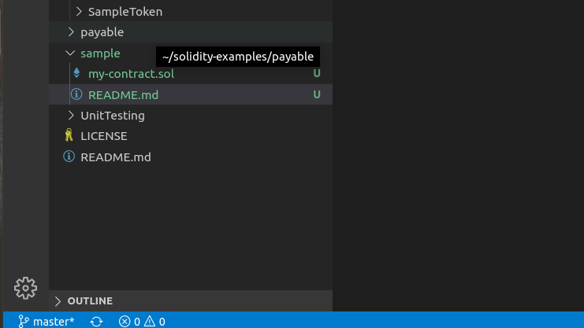
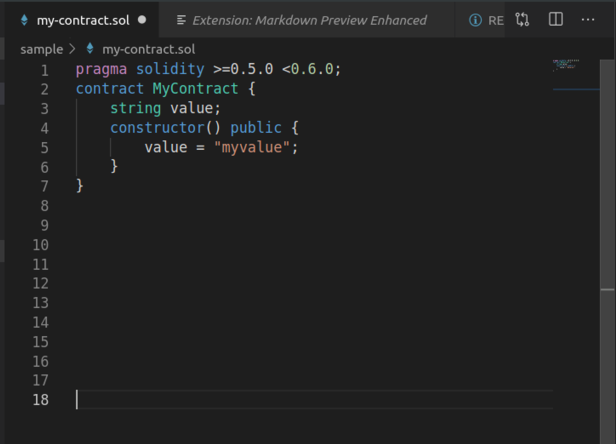
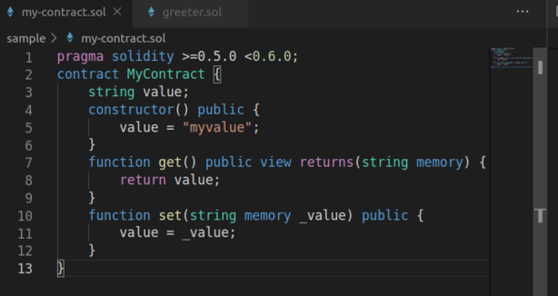
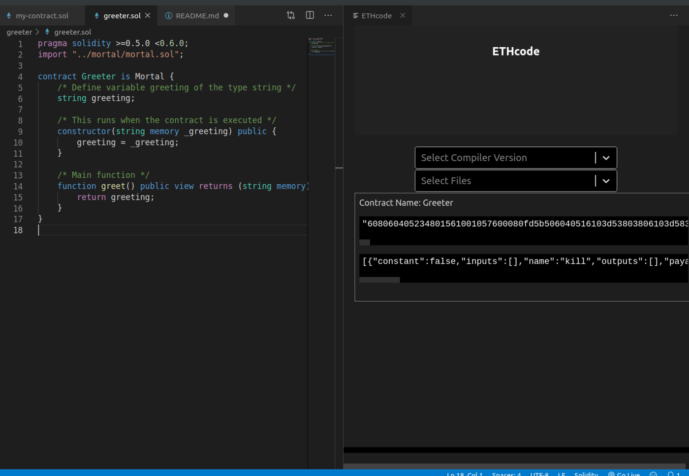

<h3>
Solidity is the main programming language for writing smart contracts for the Ethereum blockchain. It is a contract-oriented language, which means that smart contracts are responsible for storing all of the programming logic that transacts with the blockchain. It's a high-level programming language that looks a lot like JavaScript, Python, and C++. It's designed to run on the Ethereum Virtual Machine (EVM), which is hosted on Ethereum Nodes that are connected to the blockchain. It is statically typed, and supports inheritance, libraries, and more! In short, it has all the capability that you need in order build industrial strength blockchain applications.
</h3>

<h4>
Let's start by creating a new file to write some Solidity code. You can do this in the file browser on the left hand side of the screen.
</h4>



<h4>
Let's create a new file named <b>MyContract.sol</b>. On the first line of this file, we'll declare the version of the solidity programming language we want to use:
</h4>

```javascript
pragma solidity ^0.4.24;
```
<h4>
Now we can declare the smart contract like this:
</h4>

```javascript
pragma solidity >=0.5.0 <0.6.0;
contract MyContract {
    // ...
}
```
**A smart contract is a piece of code that gets executed on the Ethereum blockchain. It functions somewhat like an API microservice on the web that is publicly accessible to everyone. All of the code of the smart contract is visible to the public, and we can allow anyone connected to the network to call functions on the smart contract.**

<h4>
Now let's continue building out this smart contract. First, we'll program a simple "storage" smart contract that will be able to:
<h4>
<ul>
    <li>Store a value</li>
    <li>Retrieve this value</li>
</ul>
<h4>
We'll start by creating a way to store a string value in the smart contract like this. We'll do that with a variable called value. Solidity is a statically typed language, so we must first specify the data type when declaring the variable like this:
</h4>



**This variable is called a "state variable" because it actually persists data to the blockchain. Anytime that we set this value, the string will be saved to the blockchain! It will get written to storage, not memory. This variable also has special scope, as it is accessible to the entire smart contract unlike a local variable which is only accessible inside of functions, and will not persist after the function has been called.**

<h4>
Now let's create a function to read this value from storage. We'll start by declaring a function called get() with the function keyword like this:-
</h4>

```javascript
function get() {
    // ...
}
```
<h4>
Now we'll return the value from the state variable with the return keyword like this:
</h4>

```javascript
function get() {
    return value;
}
```

<h4>
Now we'll set the "visibility" of this function to public so that anyone connected to the blockchain can call it (not just from within the smart contract code itself):
</h4>

```javascript
function get() public view {
    return value;
}
```
<h4>
Finally, we'll specify the return value string for the function:
</h4>

```javascript
function get() public view returns(string) {
    return value;
}
```

<h4>
Awesome! Now we have a way to read this value from the smart contract. I'll show you how to do this after we compile it momentarily. Before we get there, let's create a way to set this value from outside the smart contract. We'll create a set function like this:
</h4>

```javascript
function set(string _value) public {
    // ...
}
```

<h4>
We simply created a function that accepts a _value argument of string type. This function is also publicly visible so that anyone connected to the blockchain can call it. Now let's actually update the smart contract value like this:
</h4>

```javascript
function set(string _value) public {
    // ...
}
```

<h4>
We simply created a function that accepts a _value argument of string type. This function is also publicly visible so that anyone connected to the blockchain can call it. Now let's actually update the smart contract value like this:
</h4>

```javascript
function set(string _value) public {
    value = _value;
}
```
<h4>
Here we simply assigned the passed in _value and assigned it to the value state variable. Notice that _value, prepended by an underscore is simply a local variable. This is a common convention when writing Solidity code, as well as other languages.

Now let's set a default value for the value state variable. We'll do that inside the smart contract constructor function like this:
</h4>

```javascript
constructor() public {
    value = "myValue";
}
```

<h4>
We first declare the constructor function with the constructor keyword. This function is run only once, whenever the smart contract is deployed. It also must have the public visibility.
</h4>



<h4>
Now that's the complete source code! Let's see how we can compile and deploy this smart contract. First we'll set the compiler version in the right hand side of your browser. We'll choose version 0.4.25 to compile this code.
</h4>

***Make sure you have opened the Ganache-CLI (just, open the terminal and type "ganache-cli"). And press Ctrl+Alt+E to open the EthCode extension. After that save your .sol file and then press Ctrl+Alt+C to compile. You will get to see this.***



